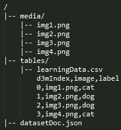
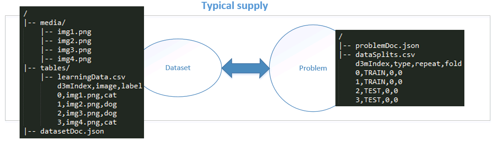
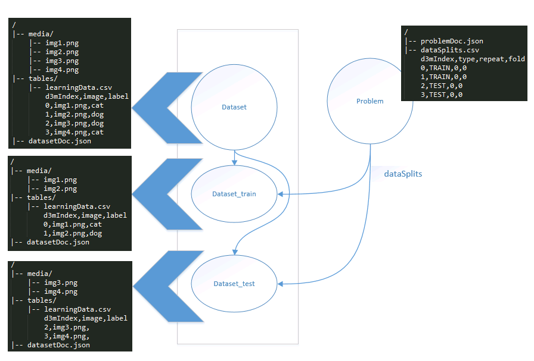
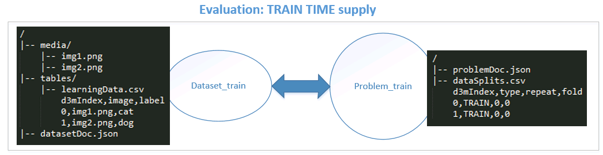
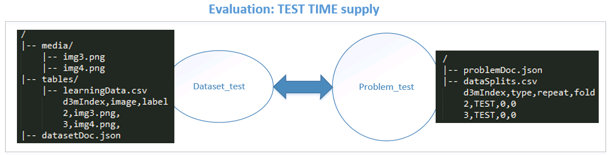

# D3MDS

D3M Data Supply (D3MDS) refers to the data infrastructure provided by MIT Lincoln Lab for the D3M program. The basic components of D3MDS includes the following: Datasets, Problems and Baseline solutions. The guiding principles for this design are as follows:
1. Keep the three entities, Dataset, Problem, and Baseline solutions, decoupled.
2. Keep a dataset self-contained.
2. Provide a uniform and consistent way of dealing with datasets, which could be full datasets, a train view of the dataset (during blind evaluation), or a test view of the dataset (during blind evaluation).
3. Allow the possibility of annotating a dataset with metadata information.
4. Dataset schema should be able to handle multiple relational tables.
3. Datasets and Problems should be decoupled.

## Dataset

One of the core components of D3MDS are datasets. Each dataset is a self-contained set of data resources. These data resources can come in many types and formats. Some of the types of data resources that one can expect to see in D3MDS include: image, video, audio, speech, text, table, graph, timeseries, etc. Each type can be supplied in one or more formats. For example, image resources can come in PNG, JPEG, etc. formats. Our file structure convention for organizing a dataset is as follows:
```
. <dataset_id>/
|-- media/
|-- text/
|-- tables/
|-- graphs/
|-- datasetDoc.json
```
Convention: The name of the root directory of a dataset is its dataset_id

Suggested sub-directory names and structure:

|                 |                                                                                                                   |
|-----------------|-------------------------------------------------------------------------------------------------------------------|
| <dataset_id>/   | the root directory                                                                                                |
| media/          | (optional) directory containing media files, if any (e.g. images, video, audio, etc.)                             |
| text/           | (optional) directory containing text documents, if any                                                            |
| tables/         | (required) directory containing tabular data. This is not optional as a dataset will contain at least one table   |
| graphs/         | (optional) directory containing graphs, if any                                                                    |
| datasetDoc.json | (required) JSON document that describes all the data resources in the dataset (an instance of the dataset schema) |

The datasetDoc.json file provides a description of all the elements of a dataset as a JSON document. This document is specified according to a predefined dataset schema. In other words, datasetDoc is an instance of datasetSchema.

A small sample Dataset is shown in the figure below




__Special "learningData" file__: All datasets will have a main data file, a dataset entry point, which can be considered as an entry point into the dataset. Its resource name is always 'learningData' and for backwards compatibility this file is always named 'learningData'. It's format is typically CSV (learningData.csv), but not necessarily the case. This file is treated as just another tabular resource and will be placed in the tables/ directory as shown below. It's columns and format will be annotated in the datasetDoc.json similar to any other table that may be part of the dataset. An example of learningDoc file can be seen in the sample dataset figure above.
```
. <dataset_id>/
|-- tables/
	|-- learningData.csv
|-- datasetDoc.json
```

### datasetSchema

* The datasetSchema is version controlled and can be found in [datasetSchema.json](../schemas/datasetSchema.json)
* Full documentation for datasetSchema can be found in [datasetSchema.md](datasetSchema.md)

## Problems

A dataset alone does not constitute a data science problem. A problem is developed over a dataset by defining a task, inputs for the task (which includes a dataset), and expected outputs for the task. Multiple problems can be developed for a single dataset. Our convention for organizing a problem is as follows:

```
. <problem_id>/
|-- dataSplits.csv 	
|-- problemDoc.json 	
```
Convention: The name of the root directory of a problem is its problem_id

|                 |                                                                                                                                |
|-----------------|--------------------------------------------------------------------------------------------------------------------------------|
| <problem_id>/   | the root directory                                                                                                             |
|dataSplits.csv   | (optional) data splits file which specifies the train/test split of the data when the split is defined manually                |
|problemDoc.json  | (required) JSON document that describes the task, inputs and expected output of the problem (an instance of the problem schema)|

A small sample Problem is shown in the figure below.


__Special "dataSplits" file__: When evaluation split has been done manually and not algorithmically, the dataSplits file contains information about which rows in learningData.csv are 'TRAIN' rows and which ones are 'TEST' rows. Normally (outside the context of the blind evaluation), performer systems can use this file to infer the trainData and testData splits. In the context of the blind evaluation, this file will be used to create two separate views of the dataset, the train view and test view, as described in the Dataset Views section below. An example of dataSplits file can be seen in the sample problem figure above.

The dataSplits file also contains the repeat number and fold number if multiple repeats or folds are used in the problem definition. Some training datasets have different evaluation procedures(e.g., 10-fold CV, 3 repeats of 20% holdout, etc.). This approach of including repeat and fold information in dataSplits will handle all the different cases. __However, during blind evaluation, only holdout method is used without any repeats. Therefore, for evaluation problems, repeat and fold will always contain 0 values__

### problemSchema
* The problemSchema is version controlled and can be found in [problemSchema.json](../schemas/problemSchema.json)
* Full documentation for problemSchema can be found in [problemSchema.md](problemSchema.md)

## Baseline solutions
A baseline solution is a solution to a problem. In its current conception, it consists of runnable code that takes as input a problem and produces an output (as specified in the problem schema). There can be multiple solution for a given problem. Our convention for organizing a python solution is as follows:
```
. <solution_id>/
|-- src/
|-- run.py
|-- predictions.csv	
```
|                 |                                                                                                                                |
|-----------------|--------------------------------------------------------------------------------------------------------------------------------|
| <solution_id>/  | the root directory                                                                                                             |
|src/             | source code for the pipeline                                                                                                   |
|run.py           | runner script for running the solution                                                                                         |
|predictions.csv  | a file containing the predictions of the solution for the give problem                                                         |
|scores.json      | a file containing the performance scores of the solution                                                                       |


# Dataset Views

For all the datasets that are released to the performers (e.g., training datasets), performers get a full view of the dataset as shown below:



However, for the blind evaluation purposes, three separate views of the dataset will be created. These are no just logical views, but two separate physical views of the dataset. For each dataset and problem combination, dataset_TRAIJN, dataset_TEST, dataset_SCORE variants will be created. By convention they always have those suffixes.
TEST view is the same as SCORE view, only that TEST view has all target values redacted.



Only the pertinent data resources from the full dataset will be replicated in the train and test views. For instance, the train view will be created by making a copy of a full dataset and deleting 'TEST' rows in learningData.csv and any other data resources that are referenced by those rows. The same is true for train view of the problem.



During blind evaluation, at test time, test view will be provided as shown below. Note that the labels in the learningDoc.csv have been removed for the test view.



