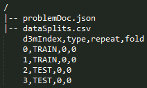

# Problem Schema (version 4.0.0)

Dataset schema provides a specification of an abstract data science problem. It is contained in the [problemSchema.json](../schemas/problemSchema.json) file. An instance of this schema is included with every problem in the problemDoc.json file.

Problem schema specifies a dataset in three sections: about, inputs, and expectedOutputs. Each of these sections are described below.

# About

The "about" section contains of some general information about the problem and consists of the following fields.

| Field                 | Description                                                                                       | 
|-----------------------|---------------------------------------------------------------------------------------------------| 
| problemID             | a unique ID assigned to a problem                                                                 | 
| problemName           | the name of a problem                                                                             | 
| problemDescription    | a brief description of the problem                                                                | 
| problemURI            | the location of the problem                                                                       | 
| taskKeywords          | a list of keywords that capture the nature of the machine learning task                           | 
| problemVersion        | the version of the current problem                                                                |
| problemSchemaVersion  | the version of the problem schema 																                                |

Currently, the keywords that can be combined to describe the task are the following:

| taskKeywords |Notes|
|--------------|-----|
|classification|supervised learning task - learn from a labeled dataset to assign a class labels to prediction samples|
|regression|supervised learning task - learn from a labeled dataset to assign a numeric values to prediction samples|
|clustering|unsupervised learning task - no labeled dataset, cluster samples and assign a cluster label to all samples|
|linkPrediction|[linkPrediction](#link-prediction) task|
|vertexNomination|[vertexNomination](#vertex-nomination) task|
|vertexClassification|[vertexClassification](#vertex-classification) task|
|communityDetection|[communityDetection](#community-detection) task|
|graphMatching|[graphMatching](#graph-matching) task|
|forecasting|data is indexed by time dimension and the task is to predict future values based on previously observed values|
|collaborativeFiltering|task of filling blank cells in a utility matrix where each cell in the matrix holds association between two entities (e.g., users and products)|
|objectDetection|[objectDetection](#object-detection-task) task|
|semiSupervised|[semiSupervised](#semi-supervised) learning task|
|unsupervised|unsupervised learning task - no labeled dataset|
|binary|binary classification task|
|multiClass|multi-class classification task|
|multiLabel|multi-label classification task|
|univariate|applied to "regression" task with a single response variable|
|multivariate|applied to "regression" task with more than one response variables|
|overlapping|applied to "communityDetection" problems to indicate overlapping communites: multiple community memberships for nodes|
|nonOverlapping|applied to "communityDetection" problems to indicate disjoint communites: single community memberships for nodes|
|tabular|indicates data is tabular|
|relational|indicates data is a relational database|
|nested |indicates that a table consists of nested tables. For example, a column entry can point to an entire table stored in a separate CSV file (similar to pointing to an image or other media files)|
|image|indicates data consists of raw images|
|audio|indicates data consists of raw audio|
|video|indicates data consists of raw video|
|speech|indicates human speech data|
|text|indicates data consists of raw text|
|graph|indicates data consists of graphs|
|multiGraph|indicates data consists of multigraphs|
|timeSeries|indicates data consists of time series|
|grouped|applied to time series data (or tabular data in general) to indicate that some columns should be [grouped](#grouped-time-series)|
|geospatial|indicates data contains geospatial information|
|remoteSensing|indicates data contains remote-sensing data|
|lupi|indicates the presence of privileged features: [lupi](#LUPI)|
|missingMetadata|indicates that the metadata for dataset is not complete|

# Inputs

This section specifies the three inputs that are required to understand and solve a problem in the context of D3M. They include: data, data splits, and performance metrics.
```
"inputs":{
  "data":[
	...
  ],
  "dataSplits":{
	...
  },
  "performanceMetrics":{
	...
  }
}
```

## Data

Data refers to the dataset(s) over which a problem is defined. A problem can refer to multiple datasets. That is captured by the datasetID field, which is a list.
```
"data":[
  {
    "datasetID":"sample_dataset_ID",
    ...
  }
]
```
<a name="target-index"></a>
In addition to the datasetID, one has to also specify target variable(s) on that dataset as part of the problem specification. Each target variable is specified by referring to a table using its "resID" and specifying its target column index and column name. For a correct specification, the target column names and indexes in problemDoc should match with the corresponding column names and indexes in datasetDoc. The redundancy of specifying a target by its column name and index is by design.
```
"data": [
  {
    "datasetID":"sample_dataset_ID"
    "targets":
    [
      {
        "targetIndex":0,
        "resID":"0",		// reference to a table in the dataset
        "colIndex":18,
        "colName":"classLabel"
      }
    ]
  }
]
```
For more information about "resID", "colIndex", and "colName", refer to the [datasetSchema.json](../schemas/datasetSchema.json)

"targets" also has an optional "numClusters" field. This field is applicable to clustering problems. It is used to specify the number of clusters to be generated by the solution algorithm (if this information is known apriori).

<a name="forecasting-horizon"></a>
If the task is time series forecasting, then the problem specification can contain additional information about the horizon of forecast. It will contain a number, which indicates the max number of time steps in future the predictions will need to be made. The horizon is in the units of `timeGranularity` in the column metadata. In the following example, assuming that the `timeGranularity` 5 days, the prediction horizon is 10 future steps, that is 50 days:
```
"forecastingHorizon":{
  "resID": "learningData",
  "colIndex": 8,
  "colName": "time",
  "horizonValue": 10.0
  }
```

Data can also contains "privilegedData" list of columns related to unavailable variables during testing. Those columns do not have data available in the test split of a dataset.
```
"data": [
  {
    "datasetID":"sample_dataset_ID"
    "privilegedData": [
      {
        "privilegedDataIndex": 0,
        "resID": "learningData",
        "colIndex": 20,
        "colName": "HISTOLOGY"
      }
    ]
  }
]
```


## Data Splits

Every problem has a special __dataSplits__ file. This file contains information about which rows in the learning data are 'TRAIN' rows and which ones are 'TEST' rows. It has the following columns: [d3mIndex, type, repeat, fold] as shown in the problem sample below.



This split file indirectly reflects the evaluation procedure that was used to define the problem. The "dataSplits" section in the problem schema contains information that can be used to infer the evaluation procedure and interpret the dataSplits file. It contains the following fields:

| Field | Description |
|-------|-------------|
| method | refers to the evaluation method reflected in the data splits. Currently, it can be one of "holdOut" or "kFold". Can be extended in future to accommodate others. It is always 'holdOut' by default |
| testSize | applicable to "holdOut" method, it specifies the size of the test split in the range 0.0 to 1.0. |
| numFolds | applicable to "kFold" method, it specifies the number of folds |
| stratified | specifies if the split is stratified or not, default value being True |
| numRepeats | specifies how many repeats, e.g., 3 repeats of 50% holdout |
| randomSeed | the random number generator seed that was used to generate the splits |
| splitsFile | the relative path to the splits file from the problem root, which is "dataSplits.csv" directly under the problem root by default|
| splitScript | the relative path from the problem root to the script that was used to create the data split (optional)  |

## Performance metrics

Another important part of a problem specification is set of metrics that will be used to evaluate the performance of a solution. The "performanceMetrics" section of the problem schema is a **list** of metrics. The provided metrics are the following.

| Metric | Notes |
|--------|-------|
| accuracy | sklearn.metrics.accuracy_score |
| precision | sklearn.metrics.precision_score |
| recall | sklearn.metrics.recall_score |
| f1 | sklearn.metrics.f1_score (pos_label=1) |
| f1Micro | sklearn.metrics.f1_score(average='micro') |
| f1Macro | sklearn.metrics.f1_score(average='macro') |
| rocAuc  | Compute Area Under the Receiver Operating Characteristic Curve (ROC AUC) - only works with binary data, requires confidence |
| rocAucMacro | Compute rocAuc metric for each label and compute unweighted mean - only works for multi-class and multi-label data, requires confidence |
| rocAucMicro | Compute rocAuc metric globally by considering each element of the label indicator matrix as a binary prediction - only works for multi-class and multi-label data, requires confidence |
| meanSquaredError | sklearn.metrics.mean_squared_error, average computed over multiple target columns |
| rootMeanSquaredError | sqrt(sklearn.metrics.mean_squared_error), average computed over multiple target columns |
| meanAbsoluteError | sklearn.metrics.mean_absolute_error, average computed over multiple target columns |
| rSquared | sklearn.metrics.r2_score |
| normalizedMutualInformation | sklearn.metrics.normalized_mutual_info_score |
| jaccardSimilarityScore | sklearn.metrics.jaccard_similarity_score |
| precisionAtTopK | number of values shared between first K entries of ground truth and predicted labels and normalized by K |
| objectDetectionAP | an implementation of mean average precision for object detection problems, mean is computed accross classes (when there are multiple classes), average accross bounding polygons of one class, requires confidence |
| hammingLoss | wraps sklearn.metrics.hamming_loss function - used for multilabel classification problems. |
| meanReciprocalRank | computes the mean of the reciprocal of elements of a vector of rankings - used for linkPrediction problems.|
| hitsAtK | computes how many elements of a vector of ranks make it to the top 'k' positions  - used for linkPrediction problems.|


**Note**: There can be multiple performance metrics included for a single problem. For example:
```
"performanceMetrics": [
      {
        "metric": "accuracy"
      },
      {
        "metric": "f1"
      }
    ]
```
### Optional parameters for metrics
Notice that there are optional metric parameters in the problemSchema:
```
...
    "K":{"type":"integer","required":false,"dependencies": {"metric":["precisionAtTopK","hitsAtK"]}},
    "posLabel":{"type":"string","required":false, "dependencies": {"metric":["f1","precision","recall"]}}
...
```

| parameter             | Notes                                                                                                                          |
|-----------------------|--------------------------------------------------------------------------------------------------------------------------------|
| K                     | This is applicable to the metrics ['precisionAtTopK', 'hitsAtK'] provided the value of K                                                 |
| posLabel              | This is applicable to 'f1', 'precision', and 'recall' metrics, and indicates which class should be treated as "positive" class |

# Expected outputs

The "expectedOutputs" in the problem schema directs the solution systems to produce output(s) in a standardized manner. 
```
"expectedOutputs":{"type":"dict","required":true,"schema":{
  "predictionsFile": {"type":"string", "required":true, "default":"predictions.csv"},
  "scoresFile": {"type":"string", "required":false, "default":"scores.csv"}
}}
```
## Predictions file

Currently, there is only one required output, which is the predictions file - all solution systems should output this file. By default the name of this file is "predictions.csv", but can be changed in a problem instance using the "predictionsFile" field in the problem schema.

The structure of predictions file depends on the metric used in the problem description.

### `objectDetectionAP` metric

`objectDetectionAP` metric requires the following structure:
 * `d3mIndex` column
 * target columns (names depend on problem target columns)
 * `confidence` column

Generally target columns are: a column for class/label and a column for object boundary.
For same input sample (image) multiple output rows can be made (matching in `d3mIndex` value),
but **only** those rows for objects which are determined to be found in the image.

|d3mIndex|class|bounding_box   |confidence|
|--------|-----|---------------|----------|
|0       |dog  |"..."          |...       |
|0       |cat  |"..."          |...       |
|0       |cat  |"..."          |...       |
|0       |cat  |"..."          |...       |
|1       |cat  |"..."          |...       |
|1       |cat  |"..."          |...       |
|1       |cat  |"..."          |...       |
|1       |pig  |"..."          |...       |
|1       |pig  |"..."          |...       |
|2       |man  |"..."          |...       |
|2       |man  |"..."          |...       |
|2       |man  |"..."          |...       |
|2       |bird |"..."          |...       |
|2       |car  |"..."          |...       |

### `rocAuc`, `rocAucMacro`, `rocAucMicro` metrics

`rocAuc`, `rocAucMacro`, `rocAucMicro` metrics require the following structure:
 * `d3mIndex` column
 * target column (name depends on the problem target column)
 * `confidence` column

Target column represents class/label. For one input sample multiple output rows should be made (matching in `d3mIndex` value),
for **all** possible class/label values, each one row. The `confidence` value should then be confidence of classification
into that class/label.

| d3mIndex | label | confidence |
|----------|-------|------------|
| 640      | 0     | 0.612      |
| 640      | 1     | 0.188      |
| 640      | 2     | 0.2        |
| 641      | 0     | 0.4        |
| 641      | 1     | 0.25       |
| 641      | 2     | 0.35       |
| 642      | 0     | 1.0        |
| 642      | 1     | 0.0        |
| 642      | 2     | 0.0        |
| 643      | 0     | 0.52       |
| 643      | 1     | 0.38       |
| 643      | 2     | 0.1        |
| 644      | 0     | 0.3        |
| 644      | 1     | 0.2        |
| 644      | 2     | 0.5        |
| 645      | 0     | 0.1        |
| 645      | 1     | 0.2        |
| 645      | 2     | 0.7        |
| 646      | 0     | 1.0        |
| 646      | 1     | 0.0        |
| 646      | 2     | 0.0        |

### `hitsAtK`, `meanReciprocalRank`
`hitsAtK` and `meanReciprocalRank`metrics require the following structure:
* `d3mIndex` column
* target column (name depends on the problem target column)
* `rank` column

`rank` is a reserved keyword. Target column represents class/label. For one input sample multiple output rows should be made (matching in `d3mIndex` value). Unlike `rocAuc` this need not have all possible class/label values. Example:

learningData.csv:

|d3mIndex    |subject |object      |relationship (target)|
|------------|--------|------------|---------------------|
|0           |James   |John        |father |
|1           |John    |Patricia    |sister |
|2           |Robert  |Thomas      |brother |
|...         |...     |...         |... |
|...         |...     |...         |... |

ground truth (coming from learningData.csv):

|d3mIndex    |relationship |
|------------|-------------|
|0           |father |
|1           |sister |
|2           |brother |

predictions.csv:   

|d3mIndex    |relationships   |rank |
|------------|----------------|-----|
|0           |brother         |1 |
|0           |cousin          |2 |
|0           |mother          |3 |
|0           |father          |4<sup>*</sup> |
|0           |grandfather     |5 |
|1           |sister          |1<sup>*</sup> |
|1           |mother          |2 |
|1           |aunt            |3 |
|2           |father          |1 |
|2           |brother         |2<sup>*</sup> |
|2           |sister          |3 |
|2           |grandfather     |4 |
|2           |aunt            |5 |

Note that the rank vector = [4,1,2]

MRR = sum(1/ranks)/len(ranks) = 0.58333   

Hits@3 = 2/3 = 0.666666; Hits@1 = 1/3 = 0.3333333; Hits@5 = 3/3 = 1.0


### Other metrics, multi-label

Output has for each input sample multiple output rows (matching in `d3mIndex` value), with `d3mIndex` column and a column for predicted labels.
Only predicted labels should be listed in output rows.

| d3mIndex | label |
|----------|-------|
| 640      | 0     |
| 640      | 1     |
| 641      | 0     |
| 642      | 0     |
| 642      | 1     |
| 642      | 2     |
| 643      | 1     |
| 644      | 1     |
| 645      | 0     |
| 645      | 2     |
| 646      | 2     |

### Other metrics

For each input sample one output row should be provided (matching in `d3mIndex` value), with `d3mIndex` column and a target column for the prediction,
or multiple target columns in `multivariate` case.
Target column names depend on problem target columns.

| d3mIndex | class |
|----------|-------|
| 640      | 0     |
| 641      | 0     |
| 642      | 2     |
| 643      | 1     |
| 644      | 1     |
| 645      | 0     |
| 646      | 2     |

__Notes__
- A target column is represented in the predictions file by its **colName**, which is specified in problemDoc.json under **inputs**->**data**->**targets**.
- We are interested in predictions for 'TEST' data points only.
- Typically, a predictions file will contain only one target column. If a given problem has multiple independent targets, it will be presented as separate problems, each with a single target. A simple test if multiple targets can be listed in one problem: is there only one confidence computed for those targets.
- If a dataset has multiple targets that are related, then the predictions file will have additional target columns. For example, see [object detection](#object-detection-task).
- Predictions can optionally have one or more of the below listed special columns which are required to compute certain metrics (e.g., `rocAuc` requires `confidence` and `meanReciprocalRank` requires `rank`). Besides `d3mIndex`, the following are reserved column names in predictions:
  - `confidence`
  - `rank`

## Scores file

A scores file can be another output from a solution pipeline when the ground truth for test data is known. Hence, this output is optional. Problem schema already specifies the given metrics under `performanceMetrics` under `inputs` section.
The standard scores.csv file can contain the following columns: `[metric, value, normalized, randomSeed, fold]`, with `normalized` (a normalized score into the range [0, 1] where higher is better),
`randomSeed` (random seed value used to run the solution pipeline), and `fold` (a 0-based index of the fold) being optional. `randomSeed` is the main seed used by a solution pipeline.
`metric` is the name of the metric as defined in `performanceMetrics` or equivalent (like d3m core package enumeration).

The baselines systems produced by MIT-LL will produce both predictions file and scores file.

Old scores file format with columns `[index, metric, value]` has been deprecated, but you might still see it around.

# Data Augmentation
The "dataAugmentation" field provides information about external sources of data that can be used to address the challenge of data augmentation. It is a list of dictionaries, each item corresponding to one external source. Each dictionary for an external source contains two fields: domain and keywords. "domain" captures the application domain(s) of an external dataset (e.g., government, census, economics) and "keywords" capture additional tags that help narrow the search (e.g., housing, household income).

# Appendix

<a name="link-prediction"></a>
## Link Prediction
Given an input graph/multiGraph, link prediction involves predicting future possible links in the network or predicting missing links due to incomplete data in the network.

<a name="vertex-nomination"></a>
## Vertex Nomination
Given an input graph, vertex nomination involves learning a model that, to each observed node in a graph, assigns a prioritized nomination list.

<a name="vertex-classification"></a>
## Vertex Classification
Given an input (possibly node-attributed) graph, vertex classification involves assigning labels/classes to unknown nodes in the network based on the classes (and attributes) of known nodes and the network structure. Similar to traditional classification tasktype, vertex classification can be of subtype binary, multiclass, or multilabel.

<a name="community-detection"></a>
## Community Detection
Given an input graph/network possibly with a community structure, community detection involves grouping nodes into sets of (overlapping or non-overlapping) groups/clusters that reflect the community structure.

<a name="graph-matching"></a>
## Graph Matching
Given two input graphs, the task here is to find an approximate matching between these two graphs based on their structural properties. We assume that a partial correspondence between graphs is given. Given two other nodes not specified in the partial correspondence, the model has to predict if they match/correspond or not.

<a name="semi-supervised"></a>
## Semi-supervised Classification
This task requires learning classification models from both labeled and unlabeled data. The structure of this task is the same as the standard classification task, except that the target column will only have a small number of the labels provided. The rest of the values in the target column will be empty. Similar to supervised classification, semi-supervised classification can be of subtype binary, multiclass, or multilabel.
## Semi-supervised Regression
This task requires learning regression models from both labeled and unlabeled data. The structure of this task is the same as the standard regression task, except that the target column will only have a small number of the labels provided. The rest of the values in the target column will be empty. Similar to supervised regression, semi-supervised regression can be of subtype univariate, or multivariate.

<a name="LUPI"></a>
## Learning Using Privileged Information
This is a special case of classification and regression problems where the training set has certain extra features called privileged features and the test set does not have those features. The models have to deal with feature mismatch across train/test split and take advantage of extra features available at train time.

<a name="grouped-time-series"></a>
## Grouped time series forecasting
Adding "grouped" qualifier to a time-series forecasting task implies that the data is grouped hierarchically. For example, the total monthly sales data of a bike manufacturer might organized per "bike-model" per "region". In other words, we get individual time series of monthly sales if the whole table is grouped buy two both ("region","bike-model"). The metadata of the dataset in datasetDoc.json will have "suggestedGroupingKey" role set on those columns that would serve as a grouping key.

<a name="object-detection-task"></a>
## Object Detection Task 
The typical structure of an objectDetection task is as follows:
```
LL1_some_object_detection_task /
  |-- LL1_some_object_detection_task_dataset /
    |-- tables /
        |-- learningData.csv
    |-- media /
        |-- img01.jpg
        |-- img02.jpg
        |-- img03.jpg
        |-- img04.jpg
        ...
    |-- datasetDoc.json
  |-- LL1_some_object_detection_task_problem /
      |-- problemDoc.json
      |-- dataSplits.csv
  |-- LL1_some_object_detection_task_solution /
      |-- src /
      |-- predictions.csv
      |-- scores.csv

```
### learningData.csv

An example learningData:

| d3mIndex  | image  | someOtherCol1 | someOtherCol2 | ...| class |bounding_box|
|-----------|--------|---------------|---------------|----|-------|------------|
|0|img01.jpg|someVal|someVal|...| dog |"10,10,60,11,60,100,10,100"|
|0|img01.jpg|someVal|someVal|...| dog |"10,20,60,31,60,110,10,110"|
|0|img01.jpg|someVal|someVal|...| tree| "20,10,70,11,70,100,20,100"|
|...|...|...|...|...|...|...|...|...|...|
|2|img03.jpg|someVal|someVal|...| cat |"50,6,100,13,100,131,50,54"|
|2|img03.jpg|someVal|someVal|...| car |"70,6,120,13,120,131,70,54"|
|...|...|...|...|...|...|...|...|...|...|

__Notes__

- Each row corresponds to a bounding box in an image
- There is a one-to-one correspondence between d3mIndex and an image. Therefore, d3mIndex is a multiIndex as it can have non-unique values as shown above.
- For this type of the datasets, the target column is a bounding polygon (named "bounding_box" in the above example).
- The type of the bounding_box column is "realVector" and captures 4 vertices using 8 coordinate values.
- The role of the bounding_box column is "boundingPolygon".
- Object detection dataset and problem can have a "class" target column. This column identifies which object is present inside the bounding polygon, when there are multiple classes of objects can be detected.
- The role of the class cloumn is suggestedTarget, indicating that model should output a class associated with a bounding box. Again if this is a case of a single class, all the output values will be the same.
- Typically, the metric that is used for this problem type requires that a confidence value be output along with the prediction.

### datasetDoc.json

An example datasetDoc:

```
...

  "dataResources": [
    {
      "resID": "0",
      "resPath": "media/",
      "resType": "image",
      "resFormat": [
        "image/png"
      ],
      "isCollection": true
    },
    {
      "resID": "learningData",
      "resPath": "tables/learningData.csv",
      "resType": "table",
      "resFormat": [
        "text/csv"
      ],
      "isCollection": false,
      "columns": [
        {
          "colIndex": 0,
          "colName": "d3mIndex",
          "colType": "integer",
          "role": [
            "multiIndex"
          ]
        },
        {
          "colIndex": 1,
          "colName": "image",
          "colType": "string",
          "role": [
            "index"
          ],
          "refersTo": {
            "resID": "0",
            "resObject": "item"
          }
        },
        {
          "colIndex": 2,
          "colName": "class",
          "colType": "string",
          "role": [
            "suggestedTarget"
          ]
        },
        {
          "colIndex": 3,
          "colName": "bounding_box",
          "colType": "realVector",
          "role": [
            "suggestedTarget",
            "boundingPolygon"
          ],
          "refersTo": {
            "resID": "learningData",
            "resObject": {
              "columnName": "image"
            }
          }
        }
      ]
    }
...
```

# FAQ

#### Why did we include repeat and fold columns in dataSplits?

A number of datasets come with hold-out CV and k-fold CV splits provided. To leverage these splits and not create our own, we have included fold and repeat columns.

#### How is a problem with multiple target variables handled?

If the targets are independent, then we will create multiple problems, one for each target. On the other hand, if the targets are joint, he "targets" field in problemSchema will contain a list of dictionaries, one for each target description in the problem. An example of joint multi-target is the object detection problem where the output is both a class (e.g., dog) and a bounding polygon.

```
"targets": [
  {
    "targetIndex": 0,
    "resID": "1",
    "colIndex": 2,
    "colName": "class"
  },
  {
    "targetIndex": 1,
    "resID": "1",
    "colIndex": 3,
    "colName": "bounding_box"
  }
  ]
```

#### How to submit predictions when there are multiple targets?

The target columns are carried over in the predictions file as shown:

|d3mIndex|class|bounding_box   |confidence|
|--------|-----|---------------|----------|
|0       |dog  |"..."          |...       |
|0       |cat  |"..."          |...       |
|0       |cat  |"..."          |...       |
|0       |cat  |"..."          |...       |
