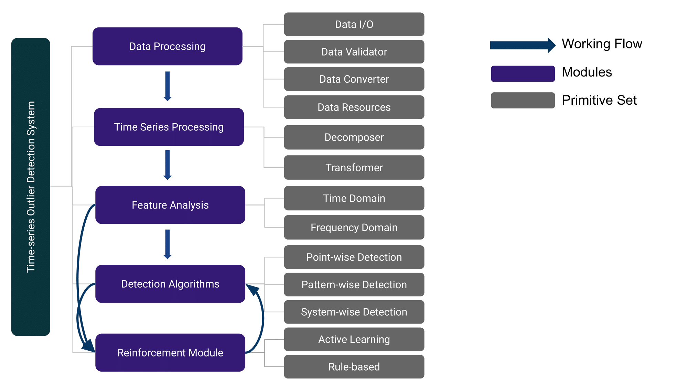

Overview
========

TODS follows the design principal of `D3M <http://datadrivendiscovery.org/>`_.
The toolkit wraps each function into ``Primitive`` class with an unified 
interface for various functionalities. The goal of this toolkit is to enable
the users to easily develop outlier detection system for multivariate time series data. 
TODS provides three pervasive outlier scenarios for the given time series data.
 * **Point-wise Outliers** are the outliers that occur on time points. In other words, each time point in the time series data could be an outlier.
 * **Pattern-wise Outliers** refer to the scenario that each outlier is define as a subsequence. It is also known as collective outlier detection. 
 * **System-wise Outliers** are defined as a set of time series. For example, each set of time series represents a device (system) that equipped with multiple sensors, where each sensor is represented as an univariate time series. The goal is to detect the anomalous devices from the normal ones.

TODS High-level Design
~~~~~~~~~~~~~~~~~~~~~~~~
Following the typical machine learning pipeline, there are 6 modules lie in TODS: Data prociessing, time series processing, feature analysis, detection algorithms and reinforcement module.

Data Processing
---------------
Data processing aims on processing data following the tabular fashion. The functionalities including: dataset loading, data filtering, data validation, data binarization, and timestamp transformation.

Timeseries Processing
---------------------
Time series processing provides multiple time series-specific preprocessing techniques including: seasonality/trend decomposition, time series transformation/scaling/smoothing.

Feature Analysis
----------------
Feature analysis module provides exhaustive feature extraction techniques from three aspects: Time domain, frequency domain and latent factor models.  
There are 30 feature extraction methods including statistical methods, time series filters, spectral transformations, and matrix factorization models.

Detection Algorithms
---------------------
Based on the three scenarios above, we provide multiple algorithms including traditional approaches (e.g. IForest, Autoregression), heuristic methods (e.g. HotSax algorithm, Matrix Profile), deep learning methods (e.g. RNN-LSTM, GAN, VAE), and ensemble methods to address each kind of outlier. 

Reincforcement Module
----------------------
Reinforcement module is designed for improve the existed model with human expertise. Specifically, rule-based filtering has been developed to allow users to transform the domain knowledge into rule filters, active learning based methods will be involved in the near future as well.

